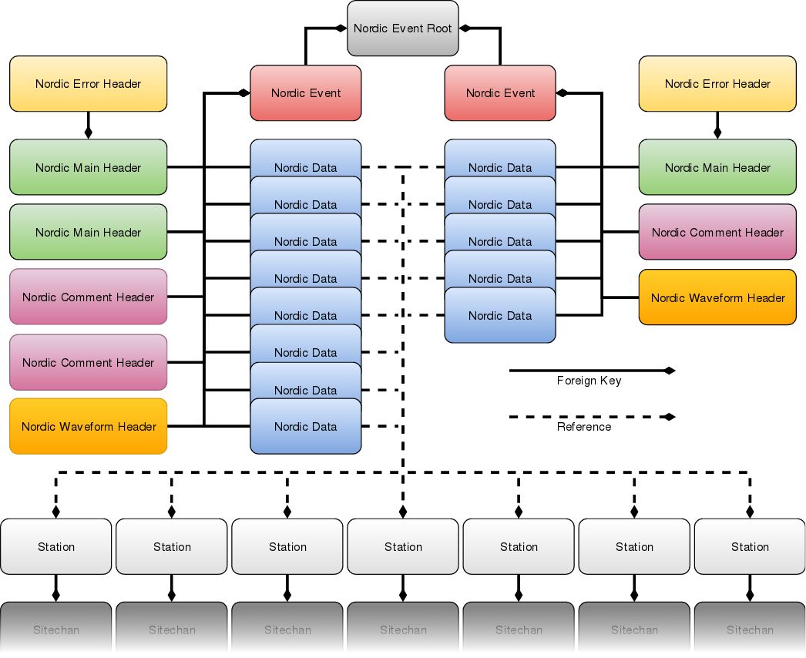
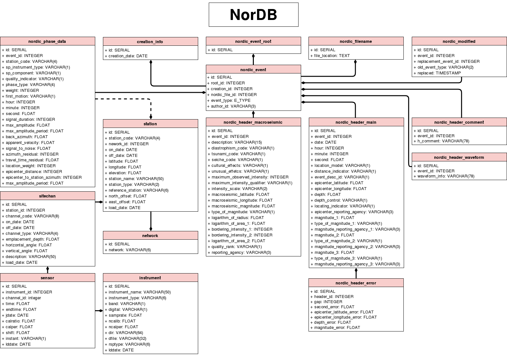

.. _database_structure:

==================
Database Structure
==================

The NorDB database runs on postgres and is created by the terminal command::
    
    nordb create

The name of the database is nordb and it can be easily accessed with the postgresql commandline tool psql::
    
    psql nordb

The most important table in the database is the 'nordic_event' table which links one seismological event to all of it's relevant information. The nordic_event also link to a 'nordic_event_root' table which links to all different analyses of the same event. In this way, old records need not to be erased and all analyses can adhere to a strict hierarcy among themselves by comparing their event_type.

    **1.1 Example diagram of two events referencing the same event root**

'nordic_filename' table links the event to a file, from which the nordic was read from. This makes tracing the old file easier. The 'creation_info' table describes the date when the event was pushed to the database. As many events are usually pushed at the same time, the creation info will be the same for all of them.

'nordic_header_main', 'nordic_header_macroseismic', 'nordic_header_comment', 'nordic_header_error', 'nordic_header_waveform' and 'nordic_phase_data' are tables that describe the event itself. These tables follow closely the `Nordic Data Format`_. The format is described in more detail in `here <nordic_desc.html>`__.

The 'nordic_phase_data' table has a column station_code, which is a undirect reference to a station table, which links the event data to all relevant station tables, which are 'station', 'network', 'sitechan', 'sensor' and 'instrument'. These tables follow closely the `CSS3.0 Data Format`_.

.. _Nordic Data Format: http://www.isc.ac.uk/standards/nordic/
.. _CSS3.0 Data Format: ftp://ftp.pmel.noaa.gov/newport/lau/tphase/data/css_wfdisc.pdf

    **1.2 The UML-diagram of NorDB**

