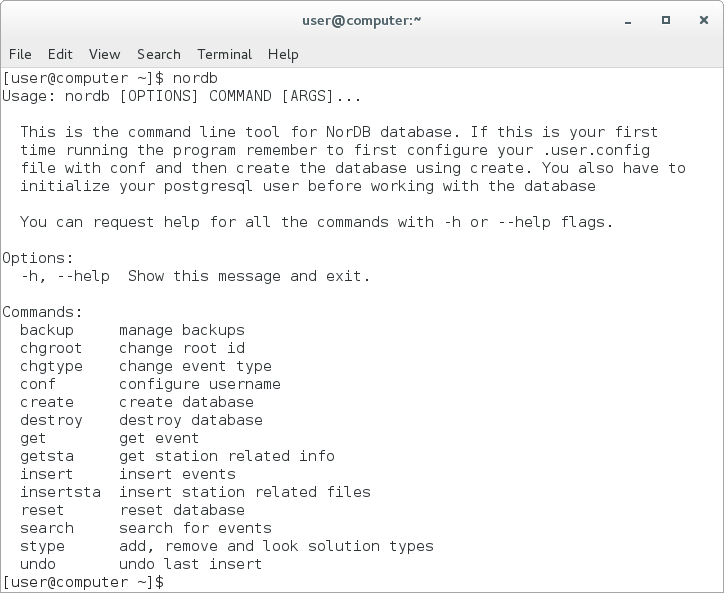

=======================
NorDB Command Line Tool
=======================

NorDB comes with a handy command line tool for managing the database. Most of the basic functions are available through it, without using the API. This tutorial goes through all of the functions in the nordb command line tool. Every single command in nordb has a help page which can be accessed with --help/-h flag alongside your command.

    **1. Screenshot of the NorDB terminal command**

Backup - Backing up your database
---------------------------------
This command is accessed by::

    nordb backup [OPTIONS]

nordb backup wraps all backup related commands into a single easy command. It has four optional flags to choose from, which are:

    - --list - Default option of the backup. It lists all backups made by user by date and filename.
    - --create / -c - creates a backup from the current database. 
    - --delete / -d - removes a backup file safely
    - --load / -l - creates the database again from a backup file

Each of the options have a simple command line interface as it prompts the required information from the user. Use the key in the list given by the program to choose which backup file you want to choose for your operation

Chgroot - Changing the root id of the event
-------------------------------------------
As described in Database Structure, the events in the database are attached to event roots, which are hub events which tie different analyses of same events together. You can change the event root of an event with Chgroot command::

    nordb chgroot [OPTIONS] EVENT_ID ROOT_ID

Here EVENT_ID refers to the event of which's root id you want to change and ROOT_ID refers to the root to which you want to attach the event. If you don't want to attach the event to an existing root id, you can just use -9 as the ROOT_ID and the program will attach the event to a different root.

Chgtype - Changing the solution type of the event
-------------------------------------------------
Every event will also be attached to a solution type in the database. This tells the user how the solution has been made and what is its relation to other solutions from the same event. More information about solution types can be read from the entry for stype command. You can change the solution type of the event with the command chgtype::

    nordb chgtype [OPTIONS] EVENT_ID SOLUTION_TYPE

EVENT_ID refers to the event of which's solution type you want to change and SOLUTION_TYPE refers to the solution type to which you want to change into. All solution types except for the default ones need to be added to the database first with stype command! If the solution type to which you are changing into does not allow multiple events of same solution types inside same event root and if there already is an event that has the same solution type to which you are changing to, the database will change the solution type of the other event into 'O'.

Conf - Configuring database username
------------------------------------
Before you can use the nordb with the database functionality, you have to configure your postgres username into it. This can be done with the conf command::

    nordb conf [OPTIONS]

When you run conf, it will prompt your postgres username and save it into it's setting files. The program has also an option flag -u/--username which lets you configure your username without the program prompting the username from you::

    nordb conf -u myusername

Create - Create the database from scratch
-----------------------------------------
Before you can use any database functionalities of nordb, you have to initialise all the tables with create command. The functionality is simple::
    
    nordb create [OPTIONS]

This will create an postgres database with name nordb to your local machine. If you want to re-create your existing database remember to run the destroy command before creating the database or use the reset command instead.

Destroy - Destroy the database
------------------------------
This command will remove the nordb database from your computer. Remember to backup your database before deleting it as the database cannot be recovered after destroy::

    nordb destroy [OPTIONS]

Get - Get events from the database
----------------------------------
